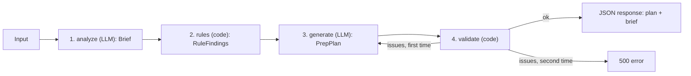

# Presales Call Prep AI Agent

Turns a job post or project description into a structured prep plan for a presales discovery call: what the client needs, what to ask, what could go wrong, how to position the team, and what the call should achieve. Built for agencies and freelancers preparing for Upwork and other presales calls.

## Links

| | |
|---|---|
| Live demo | TODO: Vercel URL |
| Demo video | TODO: Loom URL |
| Examples | [`examples/`](examples/) |

## Screenshot


## What it does

You paste up to four pieces of text:

| Field | Required | Limit |
|---|---|---|
| Job post / project description | yes | 50 to 15,000 characters |
| Client message(s) | no | 8,000 characters |
| Team expertise / tech stack | no | 5,000 characters |
| Constraints (budget, timeline, engagement model, timezone) | no | 3,000 characters |

The agent returns eight sections, always in this order:

1. **Opportunity Summary**: a short overview of what the client is looking for.
2. **Client Needs Breakdown**: the main need and possible hidden needs.
3. **Discovery Questions**: 5 to 7 questions specific to this job post.
4. **Risks / Red Flags**: 3 to 5 risks, each with a title and why it matters for this client.
5. **Suggested Positioning**: how to present the team, its expertise and its approach.
6. **Recommended Solution Approach**: a high-level idea of how the problem could be solved.
7. **Call Strategy**: what to focus on during the call and the desired outcome.
8. **Final Prep Note**: a short summary with the key focus points before the call.

Below the plan, a collapsible **Intermediate brief** shows the structured facts the first step extracted, so you can check what the plan is grounded in.

Buttons:

- **Load example** fills the form with one of the two sample job posts from `examples/`.
- **View sample output (no API call)** shows a stored plan for the SaaS example without calling the model.
- **Cancel** stops a run. The form keeps its values, so you can fix the input and generate again.
- **Copy as Markdown** and **Copy JSON** put the plan on the clipboard. **New analysis** clears the result.

The optional inputs change the plan. With team expertise the positioning connects the team's past work to the client's needs; without it the plan speaks about "the team" and invents nothing. Constraints feed the solution approach and the call strategy. The text-to-video example uses both and is the reference for this.

## Quick start (run locally)

Prerequisites: Node.js 20.9 or newer, Yarn 1.22.x (`npm i -g yarn` if missing), an Anthropic API key.

```bash
git clone <repo-url> presales-call-prep-agent
cd presales-call-prep-agent
yarn install
cp .env.example .env.local
```

Open `.env.local` and set `ANTHROPIC_API_KEY`. Then:

```bash
yarn dev
```

Open http://localhost:3000, click **Load example**, then **Generate prep plan**.

Scripts:

| Script | What it does |
|---|---|
| `yarn dev` | Start the development server |
| `yarn build` | Production build |
| `yarn start` | Serve the production build |
| `yarn lint` | Biome lint and format check |
| `yarn lint:fix` | Biome lint with safe fixes applied |
| `yarn format` | Biome format |
| `yarn typecheck` | Generate Next.js route types and run `tsc --noEmit` |

Environment variables:

| Name | Required | Default | Description |
|---|---|---|---|
| `ANTHROPIC_API_KEY` | yes, at request time | none | Server-side key for the Anthropic API. Never exposed to the browser. |

The model id is fixed to `claude-haiku-4-5` in `src/agent/llm.ts`.

Troubleshooting:

- **"Something went wrong while generating the plan"** in the UI: the server returned an error. Look at the terminal running `yarn dev`. The usual causes are a missing or invalid `ANTHROPIC_API_KEY`, the provider being overloaded (retry), or the model failing validation twice (retry).
- **A red field error on submit**: an input is outside its length limit. The counters under each field show the limit.
- **Build without a key**: `yarn build` works without `ANTHROPIC_API_KEY`. The key is read only when a request reaches the API route.

## How the agent works



**1. analyze (LLM).** Input: the four text fields, wrapped in tags (`<job_post>`, `<client_messages>`, `<team_expertise>`, `<constraints>`). Output: a `Brief`, a zod-validated object of facts only: project summary and type, tech stack, whether a budget and a timeline were mentioned, engagement model, scope clarity, scale expectations, who makes technical decisions, missing information, client signals, and a restatement of the constraints. The prompt forbids inventing anything; every field's description tells the model how to say "not in the input".

**2. rules (code).** Input: the `Brief`. Output: `RuleFindings`, three arrays of risks, questions and notes. No model call. The rules in `src/agent/steps/rules.ts`:

- No budget mentioned: add the risk "No budget stated" and a question about the budget range or how cost will be compared.
- No timeline mentioned: add a question about target dates and the first milestone.
- Scope clarity is low: add the risk "Scope is not defined enough to estimate" and propose a written scope summary after the call.
- Scale expectations are present: add a risk about the gap between the initial scope and the target scale, and a question about expected volume and viable cost per unit.
- Engagement model is unclear: ask whether the client wants fixed-price, hourly or a dedicated team.
- Technical decision maker is non-technical or unknown: ask who makes technical decisions and reviews deliverables.
- No tech stack mentioned: ask which existing systems, stack constraints or integrations the solution must work with.
- Up to two items from missing information become "Could you clarify: …?" questions.
- Constraints were provided: add a note to confirm each constraint on the call.

**3. generate (LLM).** Input: the brief, the rule findings and the original input. Output: a `PrepPlan` with the eight sections, validated against a zod schema by the SDK. The prompt makes the rule findings required content: every rule risk and question must appear in the plan, rephrased for this client and deduplicated against the model's own items.

**4. validate (code).** Input: the `PrepPlan`. Output: a list of issues, empty when the plan passes. It checks 5 to 7 questions, 3 to 5 risks, at least one hidden need, at least two focus points, no duplicate questions, and no empty strings anywhere in the plan. No model call.

**Cancellation.** Cancel aborts the browser request. On the server, the route passes `request.signal` into `runAgent`, which forwards it to every model call, so the in-flight Anthropic request is aborted and no further step starts. The handler then throws after the client is gone, which Next.js logs as an error; nothing is returned to anyone.

**Retry.** If validation returns issues, the agent calls generate once more with the issues prepended to the prompt ("The previous attempt failed validation: … Fix exactly these issues."). If the second plan fails too, the agent throws and the API returns 500. There is no third attempt.

This is a workflow with code gates between two LLM calls, not an autonomous agent that plans its own steps. The output is fixed and well defined (eight sections, known limits), so a fixed sequence with deterministic checks is more predictable, cheaper and easier to explain than a loop of tool calls.

## Architecture

```
src/
  app/                      Next.js routing only
    layout.tsx, page.tsx, globals.css
    api/prep-plans/route.ts validates the body, calls runAgent, returns JSON
  agent/                    framework-agnostic agent; no imports from next/* or the UI
    index.ts                runAgent: analyze -> rules -> generate -> validate (+ one retry)
    llm.ts                  generateObject, the only file importing TanStack AI
    format-input.ts         wraps the input fields in tags for the prompts
    schemas/                zod schemas: input.ts, brief.ts, prep-plan.ts
    steps/                  analyze.ts, rules.ts, generate.ts, validate.ts
  components/               page, form and result components
    ui/                     shadcn/ui primitives (Base UI)
  hooks/use-prep-plan.ts    client state: run, cancel, reset, show sample
  lib/                      examples, sample plan, Markdown export
examples/                   sample inputs and outputs
```

Dependency rule: `src/agent` knows nothing about Next.js or React. The route handler only validates, calls `runAgent`, and returns the result. The UI imports only the zod schemas and their types from the agent, so the form and the API validate input with the same schema.

```ts
runAgent(input: PrepInput, signal: AbortSignal): Promise<{ plan: PrepPlan; brief: Brief }>
```

## API

`POST /api/prep-plans`

Request body (JSON):

| Field | Type | Limits |
|---|---|---|
| `jobPost` | string | required, 50 to 15,000 characters after trimming |
| `clientMessages` | string | optional, up to 8,000 |
| `teamExpertise` | string | optional, up to 5,000 |
| `constraints` | string | optional, up to 3,000 |

Responses:

| Status | Body |
|---|---|
| 200 | `{ "plan": PrepPlan, "brief": Brief }` |
| 400 | `{ "error": "Invalid input", "issues": [ ...zod issues ] }` |
| 500 | Next.js default error response when the model call fails or the plan fails validation twice. Details are logged on the server only. |

The route sets `maxDuration = 120` seconds. If the client disconnects, `request.signal` aborts the in-flight model call and the run stops. A run makes two model calls, three when the retry fires, and usually takes 20 to 60 seconds.

Example (this makes a real model call and costs money):

```bash
curl -s -X POST http://localhost:3000/api/prep-plans \
  -H "Content-Type: application/json" \
  -d '{"jobPost":"We need a senior engineer to build the V1 of our product-led SaaS platform from a detailed specification, owning architecture, data models and event flows."}'
```

## Tech stack and key decisions

| Library | Version | Why |
|---|---|---|
| Next.js | 16.3.6 | One repo for UI and API; deploys to Vercel with no configuration |
| React | 19.2.8 | Comes with Next.js 16 |
| TypeScript | 5 | |
| @tanstack/ai, @tanstack/ai-anthropic | 0.61.0, 0.19.1 (exact) | One-shot structured output with a zod schema |
| zod | 4.6 | One schema language for the form, the API and the model output |
| react-hook-form, @hookform/resolvers | 7.89, 5.9 | Form state with the shared zod schema |
| Tailwind CSS | 4 | Styling |
| shadcn/ui (Base UI), @base-ui/react | 4.21, 1.8 | Accessible primitives (button, card, field, textarea, collapsible, badge) |
| axios | 1.20 | The single client request |
| mdast-util-to-markdown | 2.1 | Markdown export that escapes the model's text correctly |
| Biome | 2.5.14 | Linter and formatter in one tool |
| Yarn | 1.22 | Package manager |

**Next.js fullstack.** The UI and the API route live in one repository and one deployment. There is no separate backend to run or document.

**Hand-written orchestration.** The agent is four functions called in order in `src/agent/index.ts`. No LangChain, LangGraph or similar framework. For a fixed pipeline with two model calls, a framework would add concepts without removing any code.

**TanStack AI.** A release-candidate SDK, pinned to exact versions and confined to `src/agent/llm.ts`, so a breaking change touches one file. It was chosen for its fit with one-shot structured extraction (`chat({ outputSchema })`) and as a deliberate adoption of a new tool, not as a claim that it beats the alternatives.

**Plain JSON response.** The client sends one request and waits for the result. An earlier version streamed per-step progress over server-sent events; it was removed because it doubled the transport code for a run that takes under a minute.

**shadcn/ui, Base UI flavor.** Copy-in primitives so the effort went into the agent, not into buttons and cards. Domain components are hand-written.

**One zod schema for input.** `prepInputSchema` drives the form validation, the character counters and the API validation, so the two cannot disagree.

**Biome and Yarn 1.** One tool for lint and format; the package manager that needs no extra setup on Vercel.

## Deployment

The app is deployed on Vercel. Import the repository, add `ANTHROPIC_API_KEY` under Project, Settings, Environment Variables, and deploy. `yarn.lock` is detected automatically.

The route exports `maxDuration = 120`; check that your Vercel plan allows a 120-second function duration.

There is no rate limiting. The deployment uses the owner's API key, so set a monthly spend limit in the Anthropic console before sharing the link.

## Examples

Two sample inputs live in `examples/`, the same ones behind the **Load example** buttons.

**[`saas-founding-engineer/`](examples/saas-founding-engineer/)**: a founder with a "fully defined" SaaS spec looking for a founding engineer. Only the job post is provided. Notable in the output: the plan treats the vague engagement model and the missing budget as risks and asks to see the specification before estimating.

**[`text-to-video-pipeline/`](examples/text-to-video-pipeline/)**: an automated documentary-style text-to-video pipeline with a prototype phase and a 50+ videos/week target. Team expertise and constraints are provided. Notable in the output: the positioning uses the team's past LLM + ElevenLabs + FFmpeg work, the solution approach respects the fixed-price pilot, and the scale gap between the pilot and the target volume appears as a risk and a question.

Each folder has `input.md`, `output.md` (saved with **Copy as Markdown**) and `output.json` (saved with **Copy JSON**).

TODO: run both examples in the UI and add `output.md` and `output.json` to each folder.

## Limitations and next steps

Known limitations:

- No rate limiting; the endpoint is open and the deployment relies on a spend limit on the API key.
- No persistence; a plan exists only in the browser until you copy it.
- No per-step progress in the UI; one spinner covers the whole run.
- Output quality depends on the model. Deterministic rules guarantee that certain risks and questions are present, not that the model's own items are sharp.
- No automated tests.

Next steps:

- Vitest for `rules.ts` and `validate.ts`, the two pure functions.
- Persistence and a history of past plans.
- An evaluator step that rejects generic discovery questions and asks for a rewrite.
- Provider fallback when Anthropic is overloaded.
- Distributed rate limiting keyed by IP or by user.

## How AI tools were used

This section was drafted from the commit history and is marked for the author to review and edit.

**What Claude Code generated.** The project was built with Claude Code from a written implementation plan, one step per session: project setup with Biome and shadcn, the zod schemas, the UI components and form, the four agent steps and the orchestrator, the API route, and this README. Prompts, rules and the sample plan were generated and then edited by hand.

**What was reviewed, corrected or rewritten.** The first complete version was over-built for the task: server-sent events for per-step progress, an in-memory rate limiter, a zod-validated env loader, custom error classes, a `features/` layer for a single feature, and hand-written Markdown export. Over two review rounds these were removed or replaced, the prompts were merged into the step files, the rules became plain `if` blocks, and the Markdown export moved to `mdast-util-to-markdown` so the model's text is escaped instead of trusted. The result is about 1,600 lines of source.

**Where the AI was wrong or outdated, and how it was caught.** Training data for Next.js 16, TanStack AI and the Base UI flavor of shadcn/ui is out of date, so the project rule was to read the current documentation before touching them. Concrete cases: the Anthropic model id had to be corrected to the alias the adapter accepts (commit `429b6b1`); `tsc` failed until `next typegen` ran first in the `typecheck` script (commit `b105aff`); TanStack AI's server-sent event helpers turned out to be built for chat token streams, not custom progress events, which is part of why streaming was dropped; and several "JSON to Markdown" libraries suggested from memory were rejected after checking that each had a single maintainer and none escaped text.
